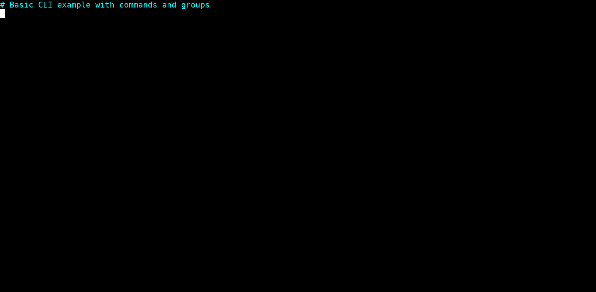

[](https://github.com/wr1/treeparse/actions/workflows/ci.yml)
[](https://github.com/wr1/treeparse/releases)
[](https://pypi.org/project/treeparse/)

[](LICENSE)

# Treeparse

**CLI framework that makes any tool immediately usable as an LLM skill.**

## Overview

Treeparse is a Python CLI framework built on `argparse`, `rich`, and `pydantic`. Its primary purpose is to let an LLM discover and use any CLI tool without additional wiring: one call to `--json` returns the full command structure in a machine-readable format, and the LLM can invoke commands from there.

Every treeparse CLI supports two built-in help modes:

- **`--help` / `-h`**: Rich tree output, human-readable, with branch pruning for subcommands.
- **`--json` / `-j`**: Structured JSON of the entire CLI tree — commands, arguments, options, types, defaults, choices.

An LLM receives the JSON in a single call and has everything it needs to use the tool as a skill: command names, argument types, defaults, and valid choices. No documentation, no prompt engineering, no extra integration layer.



## Key Features

- **Object-Oriented Structure**: Define CLIs using Pydantic models: `cli`, `group`, `command`, `argument`, `option`.
- **Rich Tree Help**: Tree-structured help with branch pruning for subcommands, including higher levels.
- **JSON Output**: `--json` / `-j` provides syntax-highlighted JSON of the full CLI structure for LLM parsing.
- **Parameter Validation**: Automatic matching of callback params to CLI definitions (names, types).
- **Folding**: Collapse deep subgroups in help output with `group.fold = True` (shows as `group [...]`).
- **Pluggability & Composition**: Full CLIs can be nested and reused as subgroups; supports YAML config and color themes.
- **Sorting**: `sort_key` for ordering elements in help output.
- **Type and Default Display**: `show_types` and `show_defaults` flags (both on by default).
- **Nargs Support**: Handles variable arguments/options (e.g., `*`, `+` for lists).
- **Boolean Handling**: Supports bool types with string-to-bool conversion and `store_true` flags.

## Usage Example

From `examples/basic.py`:

```python
from treeparse import cli, command

def hello():
    print("Hello, world!")

app = cli(
    name="basic",
    help="A basic CLI example.",
    commands=[
        command(
            name="hello",
            help="Print hello world.",
            callback=hello,
        )
    ],
)

def main():
    app.run()

if __name__ == "__main__":
    main()
```

Run: `python examples/basic.py hello`

## LLM Skill Integration

Call `--json` once to get the full CLI structure:

```
python mytool.py --json
```

```json
{
  "name": "basic",
  "help": "A basic CLI example.",
  "type": "cli",
  "options": [],
  "arguments": [],
  "subgroups": [
    {
      "name": "example",
      "type": "group",
      "commands": [
        {
          "name": "hello",
          "help": "Print hello world from the group.",
          "type": "command",
          "arguments": [
            {
              "name": "name",
              "arg_type": "str",
              "default": null
            }
          ]
        }
      ]
    }
  ],
  "commands": [
    {
      "name": "hello",
      "help": "Print hello world.",
      "type": "command"
    }
  ]
}
```

The LLM sees the full tree: groups, commands, argument names, types, defaults, and choices. No additional documentation or integration code is needed.

## Advanced Features

### Folding
Keep large CLIs readable by folding groups:

```python
user_group = group(
    name="user",
    help="User management commands",
    fold=True,                    # Shows as "user [...]" in help tree
    commands=[greet_cmd, list_cmd],
)
```

Users and LLMs can still explore the subtree with `myapp user --help` or `myapp user --json`.

### Pluggability & Composition
Embed entire CLIs as subgroups:

```python
from treeparse import cli
from basic import app as basic_app
from demo import app as demo_app

super_app = cli(
    name="supertool",
    help="Combined CLI",
    subgroups=[basic_app, demo_app],   # Full CLIs reused
)
```

See `examples/basic_super.py` for a live example.

Other pluggable features:

- **Color Themes**: `theme="github"` (or `monokai`, `mononeon`, `monochrome`, `red_white_blue`)
- **YAML Configuration**: `yml_config=Path("config.yml")` to override defaults
- **Shell Completions**: Optional `shtab` support via `[completions]` extra
- **Testing**: `CliRunner` for clean pytest integration

### Developer Validation
Run `validation_error_demo.py` to explore rich error messages for name mismatches, type mismatches, and invalid defaults.

## Structure

- **`cli`**: Root (also reusable as a sub-CLI)
- **`group`**: Nested containers with optional `fold`
- **`command` / `chain`**: Executable actions
- **`argument`** & **`option`**: Parameters

Models are modularized; initialization in `__init__.py` handles forward references.

## Current Status

- Implemented: Model definitions, tree/JSON help, validation, nargs, bool support, **folding**, **pluggability** (composition, themes, YAML), `CliRunner`.
- Examples: `basic.py`, `demo.py` (complex), `list_demo.py`, `basic_super.py` (composition), `validation_error_demo.py`, `github_theme_demo.py`, `monokai_theme_demo.py`.
- Tests: Extensive pytest coverage (>99%) with dedicated runner tests and help-output snapshot tests.
- Tools: Ruff, pytest-cov.

## Recent Improvements (v0.2.x)

- **Correctness fixes**: inherited options now included in default-vs-choices validation; `option(required=True, default=X)` is caught at construction time; callback validation uses `inspect.unwrap()` so decorated functions are inspected correctly, and async callbacks are rejected with a clear error.
- **Enum type support**: `arg_type=MyEnum` automatically populates `choices` from enum member names and converts input strings via `MyEnum[s]`.
- **Help renderer extracted**: The 440-line help renderer now lives in `treeparse.utils.help_renderer` as an isolated, testable class. `cli.py` is ~375 lines (down from ~950).
- **Parser caching**: `build_parser()` and `get_max_depth()` cache their results after the first call; do not mutate a `cli` after first `run()`.
- **YAML config scope fixed**: `yml_config` overrides now apply to options on all subgroups and commands (not only root-level options); unrecognized config keys emit `warnings.warn`.
- **New color themes**: `github` (GitHub dark palette — purple/blue/orange/red-pink) and `monokai` (classic Sublime Text palette — green/cyan/purple/pink). See `examples/github_theme_demo.py` and `examples/monokai_theme_demo.py`.

## License

MIT License.
