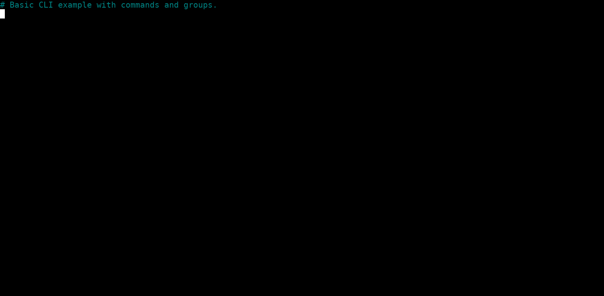

# Treeparse

CLI library aimed at displaying CLI structure in a concise and machine readable format, aimed at making CLI tools teachable to LLMs with one `--help` call. 
<!-- ```bash -->
<!-- toolx --help > helpx.txt
grk single run helpx.txt "write a shell script that sets up a project, creates user profiles for X and Y, and lists the db contents" -->
<!-- ``` -->
<!-- CLI framework using argparse, rich, and pydantic, showing a treeview representation of CLI help.  -->
<!-- Aimed at showing CLI structure.  -->


## Features

- Define CLI structure using Pydantic models for groups, commands, arguments, and options.
- Automatic validation of callback parameters against CLI definitions.
- Rich tree-based help output with optional type display.
- JSON help output.
- Easily extensible and modular.
- Command chaining with aggregate arguments and options.
- Group-level options and arguments propagated to subcommands.
- Customizable color themes (default, monochrome, mononeon).

## Installation

```bash
pip install treeparse
```

Or with development dependencies:

```bash
uv venv
uv pip install -e .[dev]
```

## Usage

### Basic Example

```python
from treeparse import cli, command

def hello():
    print("Hello, world!")

app = cli(
    name="basic.py",
    help="A basic CLI example.",
    commands=[
        command(
            name="hello",
            help="Print hello world.",
            callback=hello,
        )
    ],
)

def main():
    app.run()

if __name__ == "__main__":
    main()

```

Run with:

```bash
python examples/basic.py hello
```

### Demos 




## Development

- Run tests: `uv run pytest -v`
- Lint: `ruff check --fix`
- Format: `ruff format`

## License

MIT License. See [LICENSE](LICENSE) for details.


